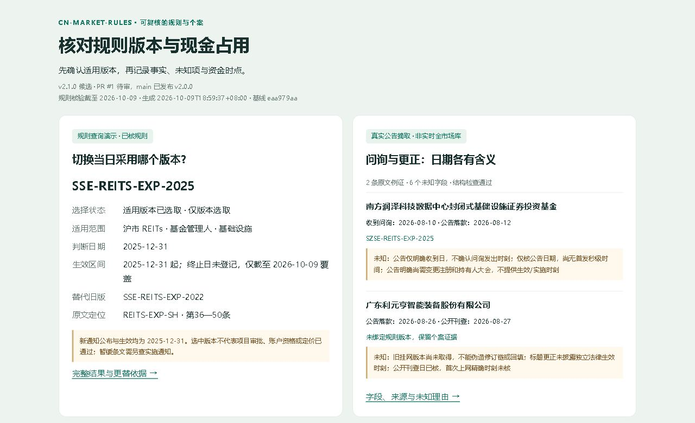

# 中国证券市场规则核对与情景工具

cn-market-rules 提供规则核对清单、个案条款模板与离线收益情景计算，记录原文依据和适用边界。

## 先看一份结果



[阅读预览与输入说明](docs/preview/README.md) · [HTML 报告](docs/preview/index.html) · [教学现金截图](docs/preview/cash.jpg)

预览采用沪市扩募版本查询、两条真实公告摘取和教学现金账本。规则版本、生效区间与未知项贴在结果旁；仅选版本不代表项目资格通过。现金案例期末 85,000.00 元，途中最低 5,000.00 元、缓冲缺口 15,000.00 元，**全部资金和支付／退款时点均为教学假设，不是实际收益或账户余额**。截图来自实际报告的浏览器渲染，保留版本与日期。

## 一条命令试用

Python 3.10+ 标准库，无额外包或账户；生成时不联网。以下 demo 属于 PR #1 待审增量：

```sh
python scripts/demo_preview.py --output-dir demo-output/first-rule-check
```

打开 demo-output/first-rule-check/index.html，同时得到三个 JSON 结果、输入快照和生成记录。输出目录须为新目录，已有目录会拒绝覆盖。JSON／终端仍可独立使用：

```sh
python scripts/scenarios.py --input examples/scenarios.json
```

这是虚构教学参数的算术示范。详细调用见[计算口径](references/calculations.md)和[交接契约](references/interfaces/common-handoff-contract.md)；研究问题可转到[主工作台问题入口](https://github.com/KILING-TASI/research-workbench/blob/main/references/practical-entry.md)。

## 版本与发布状态

状态核对：2026-10-09。main 与 [v2.0.0 Release](https://github.com/KILING-TASI/cn-market-rules/releases/tag/v2.0.0) 已发布；[PR #1](https://github.com/KILING-TASI/cn-market-rules/pull/1) 的 v2.1.0 与后续接口／预览增量仍待审，未合并、未发布新 Release。本 README 描述 PR 目录。

事件接口支持 1.0／1.1／1.2／1.3，规则目录为 1.0，共用交接为 cn-market-rules.rule-handoff/1.0（旧输入）与 1.1（显式 1.3 个案扩展）；它们与候选包 v2.1.0 是不同层的版本。Python 3.10／3.12 持续集成与发布状态见[版本说明](docs/repository-status.md)。作为 Agent 技能使用时，将完整目录放入环境的技能目录，例如 ~/.codex/skills/cn-market-rules/，从 [SKILL.md](SKILL.md) 开始。

## 已实现与边界

| 用途 | 已发布 v2.0 基线 | PR 待审增量／边界 |
|---|---|---|
| 规则核对 | IPO、转债、要约／换股／现金选择权，沪深主板 ST 与退市，沪市 REITs 首发 | 五市场核心退市指标、主体例外与2024衔接清单、深市首发；特殊条款逐案核对 |
| 个案条款 | 通用清单、条款表、收益模板、代表性原文 | 要约结果与现金选择权／换股执行条款、有限证据示例；官方摘要不冒充全文，个人实际资格与税费另核 |
| 情景计算 | 参数化损益、逆回购交收、组合可用现金与缺口 | 下修增量摊薄、沪深三路径扩募、两市 2026 日历；深市扩募显式限定已核版本日期 |
| 规则与数据交接 | 来源台账与适用范围 | 来源分层、获取／核验分离、历史截止时点、版本区间／更替／暂缓、无损共用格式；工作台消费端未联调 |

可复用规则与个案参数分开。没有真实资格、合同、申报截止或到账依据时，交付已核部分与缺口，不能将计算通过写成实际可执行。

本库主线是制度、有效版本、条款核对与给定条件情景计算。公司事件时间轴、关联检索与研究解释由 research-workbench 承接；本页仅保留有限的规则适用与证据缺口示例，不扩展为全量事件库、采集器或评分平台。

[规则核对示例](docs/regulatory-preview/README.md)展示四份公开材料如何绑定原文、日期与关联规则缺口；支持另存与同输入恢复，不能认证项目资格。

## 输入与关键口径

人阅读按 [SKILL.md](SKILL.md) 导航；个案复制[核对清单](templates/verification-checklist.md)、[条款表](templates/case-terms.md)和[收益模板](templates/scenario-analysis.md)，逐项绑定原文。

情景输入的金额、份额、费用与日期显式提供；利率用小数，`0.03` 表示 3%。工具用 Decimal，金额输出保留两位、比例保留六位；适配器保留原值和类型，不新增舍入或单位转换。未知不填零，未知布尔不填 False；市值不是可用现金。详见[计算口径](references/calculations.md)。

REITs 回拨现行已核规则为 **70%**，分母为扣除战略配售后的公开发售份额，不能写成 70‰。首发与扩募分开核对；募集失败、资格、价格、锁定期及例外逐项确认，不套用统一硬规则。

公布、生效、观察、取得、核验和公开可得时点分别记录；规则有效区间按市场、板块、主体及资产类型选择。2026 日历来自两市独立官方公告，仅覆盖常规安排，不外推 2027 或临时停市。

## 输出、来源与缺失状态

输出顺序为结论及条件、原文与适用范围、个案条款／时限、净收益情景与现金缺口、未核项。核对工具不自动认证法律资格、税务、到账或收益保证。

[来源台账](references/sources.md)与[证据规范](references/evidence-standard.md)区分公开原文、第三方聚合和付费／授权资料；获取成功与核验上游原文是不同状态。`references/source-retrieval.json` 记录下载哈希和失败，不打包原文全文。浏览器成功核读与下载失败可以同时存在。

证据字段采用 original／summary／reported／hypothesis／unknown；unknown 保留 null 与理由。规则版本返回 selected／gap／deferred／conditional／unknown／ambiguous，选中版本也不等于资格通过。见[事件接口](references/interfaces/evidence-contract.md)、[版本契约](references/interfaces/rule-version-contract.md)及[共用交接契约](references/interfaces/common-handoff-contract.md)。

AKShare 质押比例接口文档已核存在，实际聚合数据未拉取；合同融资条件仍未知。接口存在和本次取得状态不能被写成全市场能力调查结论。

## 验证范围

当前 PR 共 170 项测试通过，51 份 Markdown、70 个来源 ID、所有情景／事件示例、日历和共用格式对照通过；GitHub 检查在 PR 中记录。验证证明实现和输入结构的一致性，不能证明原文永远有效、历史首次公开时刻或未来价格。

`````sh
python -m unittest discover -s tests
python scripts/validate_package.py
```

## 后续路线

已有、待审、后续范围集中在 [PLAN.md](PLAN.md)；设计见[v2.1 修订](docs/upgrade-v2.1.md)、[风险事件增量](docs/risk-evidence-roadmap.md)及[版本选择验收](docs/version-selection-design.md)。本批已补北交所现行全文、深市扩募算术及五市场衔接清单；见[退市衔接](references/rules/delisting-transitions.md)与[个案执行条款](references/cases/execution-terms.md)。仍缺早期完整版本目录、特殊个案适用与逐户执行凭证、旧更正原版本／精确公开时刻、2027 日历及历史债券最终回收。保留缺口，不声称全市场覆盖。

## 与其他仓库的关系

规则库维护规则、证据及适用区间；research-workbench 维护研究组织与经营现金流／估值，计算引擎按各自输入契约运行。共用格式只提供包内无损适配，不增加强制依赖，不迁移其它引擎算法，不修改对方代码；消费端联调尚未完成。原入口和未有独立等价实现的功能保留。

## 许可与第三方材料

[](LICENSE)

本 PR 按用户授权为有权许可的原创代码／说明加入 [MIT](LICENSE)，逐文件范围见 [LICENSE_SCOPE.json](LICENSE_SCOPE.json) 和[范围清单](docs/license-scope.md)。原 CodeBuddy 知识包未附许可证；原包同路径专题、SKILL 及提供方案改建设计不声明整文件 MIT，保守排除未明表达。第三方原文、数据、名称、字体及截图内第三方成分不因代码许可获得再分发或商用权；详见 [THIRD_PARTY_NOTICES](THIRD_PARTY_NOTICES.md)。原 ZIP、官方全文、账户／付费资料和字体文件未打包。main 的既有 v2.0.0 发布状态不追溯改写。

## 免责声明

仅供公开信息研究与教学，不构成交易指令、法律税务意见或收益保证。

方法补强（待审）：[规则适用与执行证据方法卡](references/method-rule-applicability.md)复用现有版本边界验收，区分自动选择与人工主体／年度核对。会计准则仅定位来源，未扩审计、全量法规适用或事件库。
